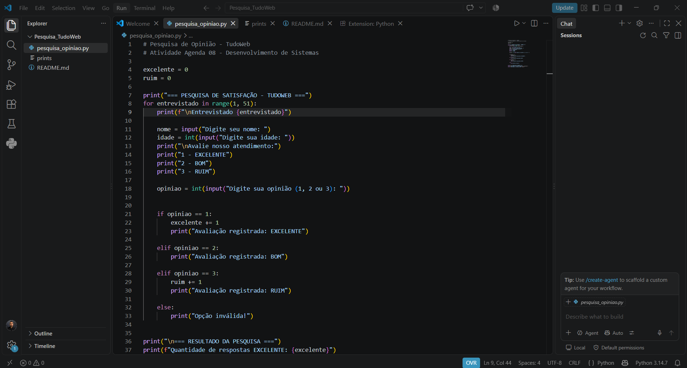
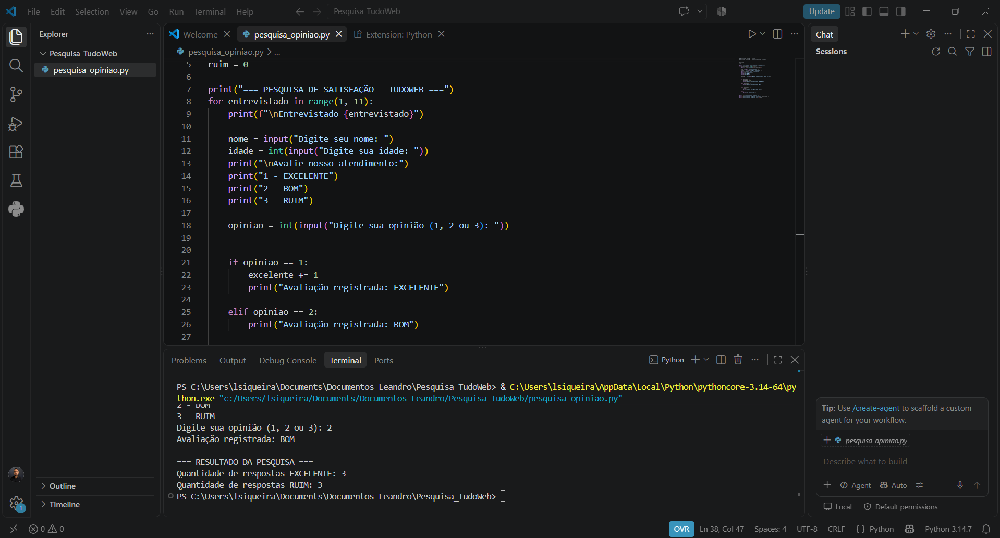

# Pesquisa de Opinião - TudoWeb

Projeto desenvolvido para a atividade da Agenda 08 da disciplina de Desenvolvimento de Sistemas.

## Objetivo

O programa realiza uma pesquisa de satisfação sobre o atendimento da empresa TudoWeb.

Para cada entrevistado, são solicitados:
- Nome
- Idade
- Opinião sobre o atendimento

As opções de avaliação são:

1 - EXCELENTE  
2 - BOM  
3 - RUIM

O programa utiliza uma estrutura de repetição para realizar a pesquisa com 50 entrevistados e estruturas de decisão para verificar cada resposta.

Ao final, são exibidas as quantidades de respostas "EXCELENTE" e "RUIM".

## Testes

Para validar o funcionamento do programa, foi realizado um teste com 10 entrevistados.

No teste realizado, foram obtidos:
- 3 respostas EXCELENTE
- 3 respostas RUIM

### Código desenvolvido

### Teste com 10 entrevistados

Após a validação, o programa foi configurado para realizar a pesquisa com 50 entrevistados.

## Tecnologias utilizadas

- Python
- Visual Studio Code
